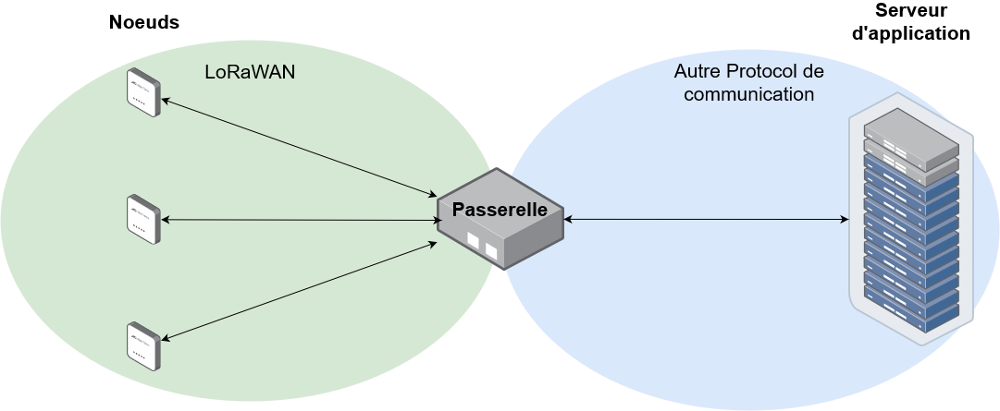

 # Specification
Le travail de sécurisation à fournir pour la fin de ce projet vise 2 parties du réseau, la *passerelle* et le *noeud* nous ne nous occuperons pas de la sécurisation de la communiction en **LoRa**.
Le LoRaWAN est un protocole de communication à longue distance et faible consomation d'energie. Il est composé de 3 services. Les *noeuds*, les *passerelles* et le *serveur d'applications*. 

Le protocole LoRa n'est pas fait pour envoyer de grandes quantitées d'information trés rapidement, on peut envoyer que quelques Kilobits par intervalle de quelques minutes.

Dans ça version 1.0 le LoRaWAN specifie déjà plusieurs directives à suivre pour le sécuriser.
Il y a plusieurs clés de ***AES 128bits*** à fournir pour sécuriser la commuication depuis le *noeud* jusqu'au *serveur d'application*.
- **NwkSKey** Network Session key 
- **AppSKet** Application Session key : chiffre le message, sans cette clées il est impossible de lire le message

Les clés **NwkSKey** et **AppSKet** sont actualisées à chaque nouvelle connexion d'un appareil, elles sont unique à chaques appareil du réseau.

Le LoRaWAN utilise des frame Counter à fin déviter les attaque par répétition.
2 conteurs sont initialisés lorsqu'un nouvel appareil est connécté.
Le Noeud incrément le compteur **FCntUP** à chaque fois que qu'il envoit une information sur le *UpLink*. Le Network serveur lui incrémente le compteur **FCntDown** à chaque fois qu'il écrit sur le *DownLink*. Pour chaque trame du réseau la valeure des compteurs est envoyé avec. Le recepteur de la trame va comparer la valeur des compteurs à l'intérieure de la trame avec ses propres compteurs et si la valeurs des compteurs de la trame est inferieur aux copteur du recepteur ce dernier va ignorer le message.
 

## Le noeud
Le noeud sera composé d'un microcontroleur, d'un capteur (ou plusieurs) et d'un module permettant la communication en LoRa.

## La passerelle
La passerelle sera hébergé sur un micro-ordinateur qui aura un module pour la communication LoRa. Le micro-ordinateur hégergera par la même occasion un serveur d'application.

Pour maitriser aux mieux notre passerelle nous allons dévelloper notre propre OS.
