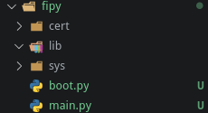

# Mise en place d'un réseau LoRaWAN simple

Nous allons voir comment mettre en place un réseau LoRaWAN simplement entre une raspberry Pi et une carte Fipy.

## Matériel :

- Carte Fipy
  - Carte pysense
- Raspberry Pi 3b / 3b+

## Mise en place carte Fipy
- Dans un premier temps installer dans Visual studio code ou Atom le plugin **Pymakr**
- Ensuite il va falloir mettre à jour le Firmware de la carte d'extension *pysense*, vous pouvez trouver la procédure  [ici](https://docs.pycom.io/pytrackpysense/installation/firmware/)
- Après la mise à jour débrancher la carte *pysense* de l'USB
- Mettre la carte *fypy* sur la carte *pysense*, **il faut que le bouton reset de la carte *fipy* soit du coté du port USB de la carte *pysense***
- Mise à jour de la carte *fipy*
  - Avnant de commencer il est recommandé d'installer la mise à jour de la carte fipy vous pouvez trouver les information d'installation pour Windows / Mac OS / Linux [à cette adresse](https://docs.pycom.io/gettingstarted/installation/firmwaretool/), nous nous concentrerons sur Linux
  - Installez les paquets *dialog* et *python-pyserial*
  - Télecharger le logiciel de mise à jour : https://software.pycom.io/downloads/linux-1.16.1.html
  - Télecharger la dernière version du firmware de la carte *Fipy*  [à cette adresse](https://github.com/pycom/pycom-micropython-sigfox/releases)
  - Après avoir extrait le logiciel de mise à jour allez dans *pycom_firmware_update_1.16.1-amd64/pyupgrade* 
  - Brancher à l'ordinateur la carte *pysense* avec la carte *fipy* installée dussus.
  - Executer la commande pour connaitre le port sur lequel est branché : 
  ```Bash 
  ./pycom-fwtool-cli list 
  ```
  - Pour ecrire la mise à jour dans la carte *fipy* entrer la commande suivante. 
  ```Bash
  sudo ./pycom-fwtool-cli -p /dev/ttyACM1 flash -t ../../FiPy-1.20.0.rc13.tar.gz
  ```
   dans notres cas la version du firmware est *1.20.0* et le port */dev/ttyACM1* 

## Programmation du noeud
Ouvrez visual studio code ou atom. Créer un dossier pour le projet, nous l'appélerons *reseau_simple*.
- Créer un fichier de configuration pour le Noeud. Cliquez sur *All commands* en bas de l'écran puis dans le mune déroulant qui s'affiche séléctionné *Project Settings*
- Créer un sous dossier pour y écrire le programme du Noeud, nous l'avons appelé *fipy*
- Dans le fichier JSON créé précedement ajouter le nom de ce dossier 
```JSON
"sync_folder": "fipy",
```
- Créer les dossiers et fichiers suivant dans ce dossier 




## Problème rencontré
### (Pymakr) There was an error with your serialport module
Ce problème apparait au démarrage de visual studio code après l'installation de *Pymakr*. Vous pouvez trouver des informatio pour résoudre le problème [ici](https://github.com/pycom/pymakr-vsc/issues/53).
#### Résolution du problème :
1. *Dans le cadre de ce projet nous utilisons un fork de **visual studio code** appelé **code** les noms de dossier sont suceptible de changer en fonction du logiciel que vous utiliser.*
2. *Nous utlisons pour ce projet la distribution Linux **Manjaro** qui est basé sur **Arch Linux** le gestionnaire de paquet serra peut-être différent du votre*
``` Bash
$ sudo pacman -Sy npm
$ npm install -g prebuild-install
$ cd ~/.vscode-oss/extensions/pycom.pymakr-1.1.3/
$ cd node_modules/@serialport/bindings
$ prebuild-install --runtime electron --target 4.2.5 --tag-prefix @serialport/bindings@ --verbose --force
```

Il faut ensuite relancer visual studio.

## Source:
Mise en place Fipy : https://docs.pycom.io/ ; https://docs.pycom.io/gettingstarted/connection/fipy/ ;
Mise en place Pymakr : https://docs.pycom.io/pymakr/installation/vscode/

