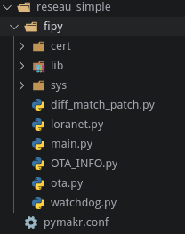

# Mise en place d'un réseau LoRaWAN simple

Nous allons voir comment mettre en place un réseau LoRaWAN simplement entre une *Raspberry Pi* et une carte *Fipy*. Le noeud devra envoyer la valeur de température jusqu'au serveur d'application.

## Matériel :

- Carte *Fipy*
  - Carte *Pysense*
- Raspberry Pi 3b / 3b+
  - Carte IMST iC880A

## Mise en place du noeud / carte *Fipy*
- Dans un premier temps, installer dans *Visual Studio Code* ou *Atom* et le plugin *Pymakr*
- Ensuite il va falloir mettre à jour le Firmware de la carte d'extension *pysense*, vous pouvez trouver la procédure  [ici](https://docs.pycom.io/pytrackpysense/installation/firmware/)
- Après la mise à jour, débranchez la carte *Pysense* de l'USB
- Mettre la carte *Fipy* sur la carte *Pysense*, **il faut que le bouton reset de la carte *Fipy* soit du coté du port USB de la carte *Pysense***
- Mise à jour de la carte *Fipy* :
  - Avant de commencer, il est recommandé d'installer la mise à jour de la carte *Fipy*. Vous pouvez trouver les informations d'installation pour Windows / Mac OS / Linux à [cette adresse](https://docs.pycom.io/gettingstarted/installation/firmwaretool/). Nous utiliserons une distribution Linux.
  - Installez les paquets *dialog* et *python-pyserial*
  - Télechargez le logiciel de mise à jour [ici](https://software.pycom.io/downloads/linux-1.16.1.html)
  - Télechargez la dernière version du firmware de la carte *Fipy*  [à cette adresse](https://github.com/pycom/pycom-micropython-sigfox/releases)
  - Après avoir extrait le logiciel de mise à jour, allez dans *pycom_firmware_update_1.16.1-amd64/pyupgrade* 
  - Branchez à l'ordinateur la carte *Pysense* avec la carte *Fipy* installée dessus.
  - Executez la commande pour connaitre le port sur lequel est branché la carte : 
  ```Bash 
  ./pycom-fwtool-cli list 
  ```
  - Pour écrire la mise-à-jour dans la carte *Fipy*, entrez la commande suivante : 
  ```Bash
  sudo ./pycom-fwtool-cli -p /dev/ttyACM1 flash -t ../../FiPy-1.20.0.rc13.tar.gz
  ```
   Dans notre cas, la version du firmware est *1.20.0* et le port */dev/ttyACM1* 

## Programmation du noeud
Ouvrez *Visual Studio Code* ou *Atom*. Créez un dossier pour le projet, nous l'appellerons *reseau_simple*.
- Créez un fichier de configuration pour le noeud. Cliquez sur *All commands* en bas de l'écran, puis dans le menu déroulant qui s'affiche, séléctionnez *Project Settings*
- Créez un sous-dossier pour y écrire le programme du noeud. Nous l'avons appelé *Fipy*
- Dans le fichier JSON créé précedement, ajoutez le nom de ce dossier : 
```JSON
"sync_folder": "fipy",
```
- Créez les dossiers et fichiers suivants dans ce dossier :
   - *boot.py* permet d'exécuter du code uniquement au démarrage de la carte
   - *main.py* permet d'exécuter du code pendant que la carte est allumée
   - *cert* contient les certificats
   - *lib* contient des bibliothèques


## Programmation du noeud à partir d'exemples
Dans notre cas nous allons baser notre programme sur un exemple que vous pouvez trouver sur github à [cette adresse](https://github.com/pycom/pycom-libraries).

Dans un premier temps téléchargez le repository. Ensuite copiez le contenu *pycom-libraries/examples/OTA-lorawan/firmware/1.17.1/flash* dans le dossier **Fipy** créé précédement.



Dans le fichier *main.py*, recopiez le code suivant.

``` Python
#!/usr/bin/env python
#
# Copyright (c) 2019, Pycom Limited.
#
# This software is licensed under the GNU GPL version 3 or any
# later version, with permitted additional terms. For more information
# see the Pycom Licence v1.0 document supplied with this file, or
# available at https://www.pycom.io/opensource/licensing
#

from loranet import LoraNet
from ota import LoraOTA
from network import LoRa
import machine
import utime

def main():
    print('Booting with firmware version 1.17.1')

    LORA_FREQUENCY = 868100000
    LORA_NODE_DR = 5
    LORA_REGION = LoRa.EU868
    LORA_DEVICE_CLASS = LoRa.CLASS_A
    LORA_ACTIVATION = LoRa.OTAA
    LORA_CRED = ('240ac4fffe0bf998', '948c87eff87f04508f64661220f71e3f', '5e6795a5c9abba017d05a2ffef6ba858')

    lora = LoraNet(LORA_FREQUENCY, LORA_NODE_DR, LORA_REGION, LORA_DEVICE_CLASS, LORA_ACTIVATION, LORA_CRED)
    lora.connect()

    ota = LoraOTA(lora)

    while True:
        rx = lora.receive(256)
        lora.send(bytes("Hello World", "utf-8"))
        print("In while")
        if rx:
            print('Received user message: {}'.format(rx))

        utime.sleep(60)

main()

#try:
#    main()
#except Exception as e:
#    print('Firmware exception: Reverting to old firmware')
#    LoraOTA.revert()


```

## Mise en place de la partie passerelle / network server / application server
Pour toute cette partie nous allons utiliser une carte *Raspberry Pi 3b+* avec une carte d'extension *IMST iC880A*

- Dans un premier temps, téléchargez l'image de *lora-getway-os-full* à l'adresse [suivante](https://artifacts.loraserver.io/downloads/lora-gateway-os/raspberrypi/raspberrypi3/3.0.0test2/).
- Une fois téléchargée, il faut extraire l'archive.
- Après cela vous devez écrire l'image extraite sur la carte SD de la *Raspberry*
   - Insérez la carte SD dans votre ordinateur
   - Repérez son point de montage à l'aide de la commande : ```lsblk```
   - Puis, écrivez l'image sur la carte SD avec la commande suivante (en veillant à bien remplacer le chemin de l'image et le point de montage de la carte SD) :
   ```Bash
   sudo dd bs=4M if=lora-gateway-os-full-raspberrypi3--20190810092349.sdimg of=/dev/mmcblk0 conv=fsync
   ```
   - Mettez la carte SD dans la *Raspberry* et testez si celle-ci *boot*.
   - Attention ! Le clavier est en QWERTY.
   - Connectez-vous avec les identifiants suivants : Login = admin / Password = admin

### Configuartion du WIFI


``` Bash
   sudo gateway-config
```
Sélétionnez *Configure WIFI* puis *ok* et *ok*

``` Bash 
enable wifi 
scan wifi
services #Pour voir les réseaux disponibles
agent on
#Choisser un des reseaux dans la liste de service 
# Exemple :
# MyNetwork               wifi_dc85de828967_68756773616d_managed_psk 
connect wifi_dc85de828967_68756773616d_managed_psk
#Entrer le mot de passe
quit
```

### Configuration de la passerelle

Faites tout le câblage nécéssaire avant de brancher la *Raspberry*.

************
/!\ Insérer schéma de câblage
************

```Bash 
sudo gateway-config
# 2 setup LoRa concentrator shield
# 1 IMST - ic880A
# Entrer 17 si vous avez suivi notre cablage
# OK
# Ok
# Ok
# Ok
# Ok
```
Maintenant à chaque démarrage, l'OS va se connecter automatiquement à ce réseau wifi.

### Paramétrage du serveur de réseau pour notre appareil

Connectez vous à l'inteface web. Pour y accéder ouvrez votre navigateur et entrez l'adresse IP de la *Raspberry* suivi de : *8080*. Dans notre cas : **http://192.168.43.134:8080** Les identifiants de connection sont les mêmes que pour vous identifer en ssh.

#### Création d'un *network server*

Allez dans l'onglet *network-servers* et cliquez sur *add*. Vous pouvez mettre comme nom ce que vous voulez, nous l'avons appelé **Fipy_Serv**. Pour *Network-server server* entrez : **localhost:8000**.
Cliquer ensuite sur *ADD NETWORK-SERVER*


#### Création d'un *Gateway-profile* :
- Name : **Fipy_GW_profile**
- Enable channels : **0, 1, 2**
- Network Server : **Fipy_Serv**

#### Creation d'une *Gateway* :
- Gateway Name : **Fipy_GW**
- Gateway description : **OTAA Fipy Gateway**
- Gateway ID : **b2 1a d4 c0 7d c6 be f6**
- Network-server : **Fipy_Serv**
- Gateway-profile : **Fipy_GW_profile**
- Gateway discovery enabled : **Autoriser**

#### Création d'un *service profile* :
- Service-profile name **M1-CSSE**
- Network-Server **Fipy_Serv**
- Add gateway metadata **Autoiser**

#### Création d'un *Device-profile* :
- Device-profile name : **Fipy_Hello_World**
- Network-Server : **Fipy_Serv**

#### Device-profiles/Create 
- Device-profile name : **Fipy_dp**
- Network-server : **Fipy_Serv**
- LoRaWAN MAC Version : **1.0.2**
- LoRaWAN MAC version supported by the device : **B**

#### Device-profiles/ota_dp
- Device support OTAA : **Autoriser**

#### Application
- Application name : Hello_World
- Application description : Hello world App
- Service-profile : M1 CSSE
- Payload codec : **None**

#### Application / Hello_world / Create

- Device name : **Fipy**
- Device déscription : **Fipy**
- Device EUI : **240ac4fffe0bf998**
- Device profile : **Fipy_dp**

#### Application / Hello_world / Devices / Fipy
- Application key : **5e6795a5c9abba017d05a2ffef6ba858**


## Problèmes rencontrés
### (Pymakr) "There was an error with your serialport module"
Ce problème apparait au démarrage de visual studio code après l'installation de *Pymakr*. Vous pouvez trouver des informations pour résoudre le problème [ici](https://github.com/pycom/pymakr-vsc/issues/53).
#### Résolution du problème :
1. *Dans le cadre de ce projet nous utilisons un fork de **Visual Studio Code** appelé **code** les noms de dossier sont suceptibles de changer en fonction du logiciel que vous utilisez.*
2. *Nous utilisons pour ce projet la distribution Linux **Manjaro** qui est basé sur **Arch Linux** le gestionnaire de paquet sera peut-être différent du votre*

``` Bash
$ sudo pacman -Sy npm
$ npm install -g prebuild-install
$ cd ~/.vscode-oss/extensions/pycom.pymakr-1.1.3/
$ cd node_modules/@serialport/bindings
$ prebuild-install --runtime electron --target 4.2.5 --tag-prefix @serialport/bindings@ --verbose --force
```

Il faut ensuite relancer Visual Studio.

## Sources:
- Mise en place Fipy : https://docs.pycom.io/ ; https://docs.pycom.io/gettingstarted/connection/fipy/ ;
- Mise en place Pymakr : https://docs.pycom.io/pymakr/installation/vscode/ ; https://docs.pycom.io/pymakr/toolsfeatures/
- Programmation Noeud : https://docs.pycom.io/tutorials/lora/lorawan-otaa/ ;
- LoRa Server pour Raspberry : https://www.loraserver.io/lora-gateway-os/install/raspberrypi/

- Partie Passerelle Box LoRa : https://www.loraserver.io/guides/first-gateway-device/ ; https://docs.pycom.io/tutorials/all/ota-lorawan/