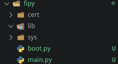

# Mise en place d'un réseau LoRaWAN simple

Nous allons voir comment mettre en place un réseau LoRaWAN simplement entre une raspberry Pi et une carte Fipy. Le Noeud devra envoyer la valeure de température jusqu'au serveur d'application.

## Matériel :

- Carte Fipy
  - Carte pysense
- Raspberry Pi 3b / 3b+
  - Carte IMST iC880A

## Mise en place du Noeud / carte Fipy
- Dans un premier temps installer dans Visual studio code ou Atom le plugin **Pymakr**
- Ensuite il va falloir mettre à jour le Firmware de la carte d'extension *pysense*, vous pouvez trouver la procédure  [ici](https://docs.pycom.io/pytrackpysense/installation/firmware/)
- Après la mise à jour débrancher la carte *pysense* de l'USB
- Mettre la carte *fypy* sur la carte *pysense*, **il faut que le bouton reset de la carte *fipy* soit du coté du port USB de la carte *pysense***
- Mise à jour de la carte *fipy*
  - Avant de commencer il est recommandé d'installer la mise à jour de la carte fipy vous pouvez trouver les information d'installation pour Windows / Mac OS / Linux [à cette adresse](https://docs.pycom.io/gettingstarted/installation/firmwaretool/), nous nous concentrerons sur Linux
  - Installez les paquets *dialog* et *python-pyserial*
  - Télecharger le logiciel de mise à jour : https://software.pycom.io/downloads/linux-1.16.1.html
  - Télecharger la dernière version du firmware de la carte *Fipy*  [à cette adresse](https://github.com/pycom/pycom-micropython-sigfox/releases)
  - Après avoir extrait le logiciel de mise à jour allez dans *pycom_firmware_update_1.16.1-amd64/pyupgrade* 
  - Brancher à l'ordinateur la carte *pysense* avec la carte *fipy* installée dussus.
  - Executer la commande pour connaitre le port sur lequel est branché : 
  ```Bash 
  ./pycom-fwtool-cli list 
  ```
  - Pour ecrire la mise à jour dans la carte *fipy* entrer la commande suivante. 
  ```Bash
  sudo ./pycom-fwtool-cli -p /dev/ttyACM1 flash -t ../../FiPy-1.20.0.rc13.tar.gz
  ```
   dans notres cas la version du firmware est *1.20.0* et le port */dev/ttyACM1* 

## Programmation du noeud
Ouvrez visual studio code ou atom. Créer un dossier pour le projet, nous l'appélerons *reseau_simple*.
- Créer un fichier de configuration pour le Noeud. Cliquez sur *All commands* en bas de l'écran puis dans le mune déroulant qui s'affiche séléctionné *Project Settings*
- Créer un sous dossier pour y écrire le programme du Noeud, nous l'avons appelé *fipy*
- Dans le fichier JSON créé précedement ajouter le nom de ce dossier 
```JSON
"sync_folder": "fipy",
```
- Créer les dossiers et fichiers suivant dans ce dossier
   - *boot.py* permet d'executer du code uniquement au démarrage de la carte
   - *main.py* permet d'executer du code pendatn que la carte est allumée
   - *cert* contient les certificats
   - *lib* contient des bibliothèque




- Dans le fichier main.py recopier le code suivant pour pour parametrer un code LoRa avec une authentification OTAA (Over The Air Authentification) ce code provient des exemples fournit par Pycom : https://docs.pycom.io/tutorials/lora/lorawan-otaa/
``` Python
from network import LoRa
import socket
import time
import ubinascii

# Initialise LoRa in LORAWAN mode.
# Please pick the region that matches where you are using the device:
# Asia = LoRa.AS923
# Australia = LoRa.AU915
# Europe = LoRa.EU868
# United States = LoRa.US915
lora = LoRa(mode=LoRa.LORAWAN, region=LoRa.EU868)

# create an OTAA authentication parameters
app_eui = ubinascii.unhexlify('ADA4DAE3AC12676B')
app_key = ubinascii.unhexlify('11B0282A189B75B0B4D2D8C7FA38548B')

# join a network using OTAA (Over the Air Activation)
lora.join(activation=LoRa.OTAA, auth=(app_eui, app_key), timeout=0)

# wait until the module has joined the network
while not lora.has_joined():
    time.sleep(2.5)
    print('Not yet joined...')

# create a LoRa socket
s = socket.socket(socket.AF_LORA, socket.SOCK_RAW)

# set the LoRaWAN data rate
s.setsockopt(socket.SOL_LORA, socket.SO_DR, 5)

# make the socket blocking
# (waits for the data to be sent and for the 2 receive windows to expire)
s.setblocking(True)

# send some data
s.send(bytes([0x01, 0x02, 0x03]))

# make the socket non-blocking
# (because if there's no data received it will block forever...)
s.setblocking(False)

# get any data received (if any...)
data = s.recv(64)
print(data)
```

## Mise en place de la partie passerelle / network server / application server
Pour toute cette partie nous allons utiliser une carte *Raspberry Pi 3b+* avec une carte d'extension *IMST iC880A*

- Dans un premier temps téléchargez l'image de *lora-getway-os-full* à l'adresse suivante : https://artifacts.loraserver.io/downloads/lora-gateway-os/raspberrypi/raspberrypi3/3.0.0test2/
- Une fois télécharger il faut extraire l'archive.
- Après cela vous devez ecrire l'image extraite sur la carte SD de la Raspberry
   - Insérer la carte SD dans votre ordinateur
   - Reperer sont point de montage à l'aide de la commande ```lsblk```
   - Puis écriver l'amage sur la carte SD avec la commande suivante (en veyant a bien remplacer le chemain de l'image et le point de montage de la carte SD):
   ```Bash
   sudo dd bs=4M if=lora-gateway-os-full-raspberrypi3--20190810092349.sdimg of=/dev/mmcblk0 conv=fsync
   ```
   - Mettez la carte SD dans la Raspberry et tester si celle-ci boot.
   - Attention le clavier est en QWERTY
   - Connectez-vous avec les identifiants suivant Login = admin / Password = admin

### Configuartion du WIFI


``` Bash
   sudo gateway-config
```
Sélétionner *Configure WIFI* puis *ok* et *ok*

``` Bash 
enable wifi 
scan wifi
services #Pour voir les réseaux disponibles
agent on
#Choisser un des reseaux dans la liste de service 
# Exemple :
# MyNetwork               wifi_dc85de828967_68756773616d_managed_psk 
connect wifi_dc85de828967_68756773616d_managed_psk
#Entrer le mot de passe
quit
```

### Configuration de la passerelle
Faite tout le cablage nécéssaire avant de brancher la Raspberry.
************
Insérer schema de cablage
************

```Bash 
sudo gateway-config
# 2 setup LoRa concentrator shield
# 1 IMST - ic880A
# Entrer 17 si vous avez suivi notre cablage
# OK
# Ok
# Ok
# Ok
# Ok
```
Maintenant à chaque démarrage l'OS va se connecter automatiquement à ce réseau wifi.

### Parametrage du Serveur de réseau pour notre Appareil
Connecter vous à l'inteface web. Pour y accéder ouvrez votre navigateur et entrez l'adresse IP de la Raspberry suivi de *:8080* Dans notres cas : **http://192.168.43.134:8080** Les idantifiants de connections sont les mêmes que pour vous identifer en ssh.

#### Création d'un Network Server
Allez dans l'onglet *Network-servers* et cliquez sur *add*. Vous pouvez mettre comme nom ce que vous voulez, nous l'avons appelé **Fipy_Serv**. Pour *Network-server server* entrez **localhost:8000**.
Cliquer ensuite sur *ADD NETWORK-SERVER*


#### Création d'un Gateway-profiles :
- Name : **Fipy_GW_profile**
- Enable channels : **0, 1, 2**
- Network Server : **Fipy_Serv**

#### Creation d'une Gateway :
- Gateway Name : **Fipy_GW**
- Gateway description : **OTAA Fipy Gateway**
- Gateway ID : **b2 1a d4 c0 7d c6 be f6**
- Network-server : **Fipy_Serv**
- Gateway-profile : **Fipy_GW_profile**
- Gateway discovery enabled : **Autoriser**

#### Création d'un service profile :
- Service-profile name **M1-CSSE**
- Network-Server **Fipy_Serv**
- Add gateway metadata **Autoiser**

#### Création d'un service pour le noeud :
- Device-profile name : **Fipy_Hello_World**
- Network-Server : **Fipy_Serv**

#### Device-profiles/Create 
- Device-profile name : **Fipy_dp**
- Network-server : **Fipy_Serv**
- LoRaWAN MAC Version : **1.0.2**
- LoRaWAN MAC version supported by the device : **B**

#### Device-profiles/ota_dp
- Device support OTAA : **Autoriser**

#### Application
- Application name : Hello_World
- Application description : Hello world App
- Service-profile : M1 CSSE
- Payload codec : **None**

#### Application / Hello_world /Creat

- Device name : **Fipy**
- Device déscription : **Fipy**
- Device EUI : **ADA4DAE3AC12676B**
- Device profile : **Fipy_dp**

#### Application / Hello_world / Devices / Fipy
- Application key : **11 B0 28 2A 18 9B 75 B0 B4 D2 D8 C7 FA 38 54 8B**

## Problème rencontré
### (Pymakr) There was an error with your serialport module
Ce problème apparait au démarrage de visual studio code après l'installation de *Pymakr*. Vous pouvez trouver des informatio pour résoudre le problème [ici](https://github.com/pycom/pymakr-vsc/issues/53).
#### Résolution du problème :
1. *Dans le cadre de ce projet nous utilisons un fork de **visual studio code** appelé **code** les noms de dossier sont suceptible de changer en fonction du logiciel que vous utiliser.*
2. *Nous utlisons pour ce projet la distribution Linux **Manjaro** qui est basé sur **Arch Linux** le gestionnaire de paquet serra peut-être différent du votre*
``` Bash
$ sudo pacman -Sy npm
$ npm install -g prebuild-install
$ cd ~/.vscode-oss/extensions/pycom.pymakr-1.1.3/
$ cd node_modules/@serialport/bindings
$ prebuild-install --runtime electron --target 4.2.5 --tag-prefix @serialport/bindings@ --verbose --force
```

Il faut ensuite relancer visual studio.

## Sources:
- Mise en place Fipy : https://docs.pycom.io/ ; https://docs.pycom.io/gettingstarted/connection/fipy/ ;
- Mise en place Pymakr : https://docs.pycom.io/pymakr/installation/vscode/ ; https://docs.pycom.io/pymakr/toolsfeatures/
- Programmation Noeud : https://docs.pycom.io/tutorials/lora/lorawan-otaa/ ;
- LoRa Server pour Raspberry : https://www.loraserver.io/lora-gateway-os/install/raspberrypi/

- Partie Passerelle Box LoRa : https://www.loraserver.io/guides/first-gateway-device/ ; https://docs.pycom.io/tutorials/all/ota-lorawan/