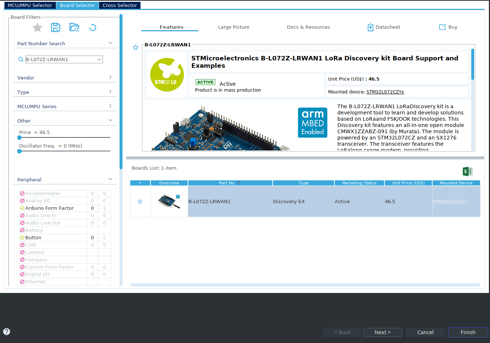
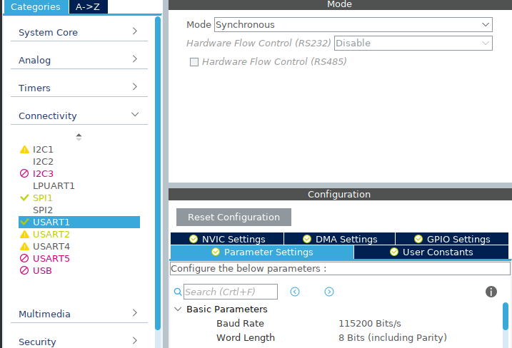
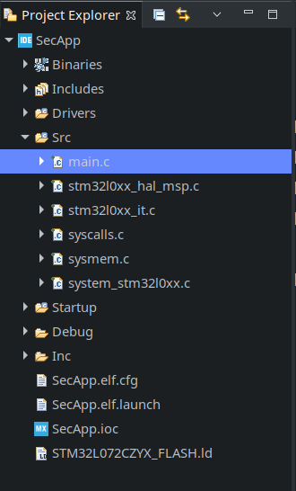

************************************************************************
Creation d'un programme de test pour y mettre des fonctions de sécurités
************************************************************************

Pour faciliter l'implémentation des fonctions de sécurités, nous avons créé un programme simple utilisant uniquement des fonctions faites par STM.
Le programme que nous avons créé inverse l'état de 3 LEDs à des intervalle différents, et tant que l'utilisateur appui sur le bouton bleu (USER) de la carte les LEDs restes éteintes. Le programme écrit aussi une clé secrète sur le port série.
Si nous envoyons la clé secrète sur la liaison série, c'est pour éviter que le compilateur optimise le code en la supprimant, ce qui serrait possible si cette variable n'est pas utilisée.
Installation du logiciel
########################

Pour ce programme, nous utilisons *CubeIDEv1.0.2* qui est l'IDE de *STMicroelectronic* permettant une configuration facile des horloges, des entrées sortie du micro contrôleur.
Vous pouvez le télécharger pour vôtres plateforme à cette adresse : https://www.st.com/en/development-tools/stm32cubeide.html.

Une fois le fichier téléchargé, vous devez l'extraire. Et lancer le script d'installation avec les droits d'administrateur et suivez les consignes.

.. code-block:: Bash

    unzip en.en.st-stm32cubeide_1.1.0_4551_20191014_1140_amd64.sh.zip
    sudo sh ./en.en.st-stm32cubeide_1.1.0_4551_20191014_1140_amd64.sh/st-stm32cubeide_1.1.0_4551_20191014_1140_amd64.sh

Configuration du projet
#######################

Dans le logiciel, vous devez commencer par créer un nouveau projet.
File -> New -> STM32 PRoject

Dans la fenêtre qui c'est ouverte, aller sur l'onglet "board selector" et dans le champ de recherche "B-L072Z-LRWAN1". 

Sélectionner la carte puis cliquez sur "Next", entrer le nom de votre projet puis cliquez sur "Finish".

.. image:: img/nomproj.png
    :align: center

Programmation
#############

Pour commencer, nous allons paramétrer les I/O, à savoir 3 LEDS et un Bouton Poussoir.

Dans l'arborescencedu projet (fenêtre à gauche) sélectionner le fichier avec l'extension *.ioc* c'est un fichier qui va vous permettre de facilement configurer les I/O.

Pour configurer les I/O cliquez sur leurs identifiants, sur la figure de droite. Sélectionner *GPIO_Output* pour les LEDs et *GPIO_Input* pour le bouton.
En se référant à la documentation les I/O à configurer sont les suivantes :

* PB5 = Led_Vert
* PB6 = Led_Bleu
* PB7 = Led_Rouge
* PB2 = Bouton Pression

Pour faciliter la programmation avec des noms personnalisés pour ces I/O, vous pouvez définir des *label* dans la colonne "User label" du tableau "GPIO".

Vous devriez avoir une configuration comparable à celle de la figure suivante.

.. image:: img/config.png
    :align: center

Maintenant nous allons configurer L'UART1, dans la catégorie "Connectivity" cliquer sur "USART1" mettez le, en mode "Synchronous" et réglez le *Baud Rate* à 115200.

Pour générer le code vous devez cliquer sur l'icône "Device Configuration Tool Code Generation" dans la barre d'outil en haut de l'écran.

.. image:: img/genererconfig.png
    :align: center

Dans l'arborescence du projet, déplacez-vous jusqu'au fichier *main.c*

Dans les variable privé ~ligne 52 vous allez ajouter un buffer et nôtres clés secrète.

.. code-block:: C

    uint8_t buffer[2];
    char SECRET_KEY[16]	= {0x2B, 0x7E, 0x15, 0x16, 0x28, 0xAE, 0xD2, 0xA6, 0xAB, 0xF7, 0x15, 0x88, 0x09, 0xCF, 0x3F, 0x3C};

Dans la partie "USER CODE BEGIN 2" ~ ligne 156 nous allons initialiser nos LEDs dans l'état éteint, puis envoyer notre clé sur la liaison série.

.. code-block:: C

    HAL_GPIO_WritePin(LED_Blue_GPIO_Port, LED_Blue_Pin, 0);
    HAL_GPIO_WritePin(LED_Green_GPIO_Port, LED_Green_Pin, 0);
    HAL_GPIO_WritePin(LED_Red_GPIO_Port, LED_Red_Pin, 0);

    for (int i = 0; i < 16; i++ ){

	    buffer[0] = SECRET_KEY[i];

	    buffer[1] = '\n';
	    HAL_USART_Transmit(&husart1, buffer, sizeof(buffer), 1000);
    }

Dans la boucle "while(1)" ~ligne 187, de la fonction "main" du programme vous allez écrire le programme faisant clignoter les LEDs gère le bouton, tout en envoyant la clé sur la liaison série.

.. code-block:: C

	for (int i = 0; i < 16; i++ ){
	    buffer[0] = SECRET_KEY[i];
	    HAL_USART_Transmit(&husart1, buffer, sizeof(buffer), 1000);
	}
	buffer[0] = '\n';
	HAL_USART_Transmit(&husart1, buffer, sizeof(buffer), 1000);
	HAL_Delay(1000);
	if (HAL_GPIO_ReadPin(BP_USER_GPIO_Port, BP_USER_Pin) == 0){
	    HAL_GPIO_WritePin(LED_Blue_GPIO_Port, LED_Blue_Pin, 0);
	    HAL_GPIO_WritePin(LED_Green_GPIO_Port, LED_Green_Pin, 0);
	    HAL_GPIO_WritePin(LED_Red_GPIO_Port, LED_Red_Pin, 0);
	}
	else{
	    //HAL_Delay(1000);
	    HAL_GPIO_TogglePin(LED_Red_GPIO_Port, LED_Red_Pin);
	    HAL_Delay(500);
	    HAL_GPIO_TogglePin(LED_Blue_GPIO_Port, LED_Blue_Pin);
	    HAL_Delay(250);
	    HAL_GPIO_TogglePin(LED_Green_GPIO_Port, LED_Green_Pin);
	}

Lancer le projet
################

Pour écrire le code sur la carte, vous devez d'abord la brancher à votre ordinateur.
Puis lancer le débuggage, pour ça cliquez sur l'icône en forme de virus vert dans la barre d'outils au-dessus du code.

.. image:: img/BPDebug.png
    :align: center 

CubeIDE va passer en mode "Débuggage" une fois que le programme est chargé, vous pouvez soit, débrancher et rebrancher la carte pour le lancer ou vous pouvez aussi le démarrer depuis l'interface de l'IDE en cliquant sur l'icône "Resume"

.. image:: img/Rresume.png
    :align: center

Fonctions de sécurités
######################

RDP
===

Pour implémenter la contre mesure RDP, vous devez tout d'abord créer une variable en dessous de celles créées précédemment.
Cette variable contiendra nôtres configuration personnalisée des octets d'Options.

.. code-block:: C

	FLASH_OBProgramInitTypeDef myconf;	//Option bytes config perso for RDP

En suite, il faut ajouter le code suivant à l'initialisation du système ~ligne 113.

.. code-block:: C

 	// Implémentation de RDP
 	if (HAL_FLASH_Unlock() == HAL_OK){	//deverouille la memoire flash

		  if(HAL_FLASH_OB_Unlock() == HAL_OK){	// deverouille les options byte dans la memoire flash

			  HAL_FLASHEx_OBGetConfig(&myconf);	// Recupere la configuration actuelle des options bytes

			  if(myconf.RDPLevel == OB_RDP_LEVEL0){	// Test si RDP est désactiver

			  	  myconf.RDPLevel = OB_RDP_LEVEL1;	//Mettre à 1 pour avoir le niveau 1

			  	  HAL_FLASHEx_OBProgram(&myconf);	// Ecrit la configuration

			  	  HAL_FLASH_OB_Launch();	// applique la configuration des options bytes

			  	  HAL_FLASH_OB_Lock();	//verouille les options byte dans la memoire flash
			}

		}
		  HAL_FLASH_Lock();	//verouille la memoire flash
 	}

PCROP et RDP
============

Pour implémenter PCROP en plus de RDP, il faut rajouter une variable pour la configuration des octets d'option avancé à coté de la variable créé précédemment.

.. code-block:: C

	FLASH_AdvOBProgramInitTypeDef myconfAdv;

Il faut ensuite modifier le morceau de code écrit précédemment pour y ajouter la configuration de PCROP.

.. code-block:: C

	if (HAL_FLASH_Unlock() == HAL_OK){	//deverouille la memoire flash

	if(HAL_FLASH_OB_Unlock() == HAL_OK){	// deverouille les options byte dans la memoire flash

		HAL_FLASHEx_OBGetConfig(&myconf);	// Recupere la configuration actuelle des options bytes
		HAL_FLASHEx_AdvOBGetConfig(&myconfAdv);	//Récupère la configuration du registre où sont stocké les configurations de pcrop

		if(myconf.RDPLevel == OB_RDP_LEVEL0){

		  	myconfAdv.PCROPSector = OB_PCROP_AllPages - OB_PCROP_Pages32to63;	//Choix des secteur à sécuriser
		  	 myconfAdv.PCROPSector2 = OB_PCROP_AllPages;
			 myconfAdv.PCROPState = OB_PCROP_STATE_ENABLE;
		  	 myconf.RDPLevel = OB_RDP_LEVEL1;	//Mettre à 1 pour avoir le niveau 1
		  	 HAL_FLASHEx_OB_SelectPCROP();	//Active PcROP
		  	 HAL_FLASHEx_AdvOBProgram(&myconfAdv);
		  	 HAL_FLASHEx_OBProgram(&myconf);	// Ecrit la configuration
		  	 HAL_FLASH_OB_Launch();	// applique la configuration des options bytes
		  	 HAL_FLASH_OB_Lock();	//verouille les options byte dans la memoire flash
		}
	  }
	  HAL_FLASH_Lock();	//verouille la memoire flash
	}

La liste des constantes définissant les secteurs de la mémoire se trouve dans le fichier : *Drivers/STM32L0xx_HAL_Driver/Inc/stm32l0xx_hal_flash_ex.h*, les définitions commence à partir de la ligne 489.