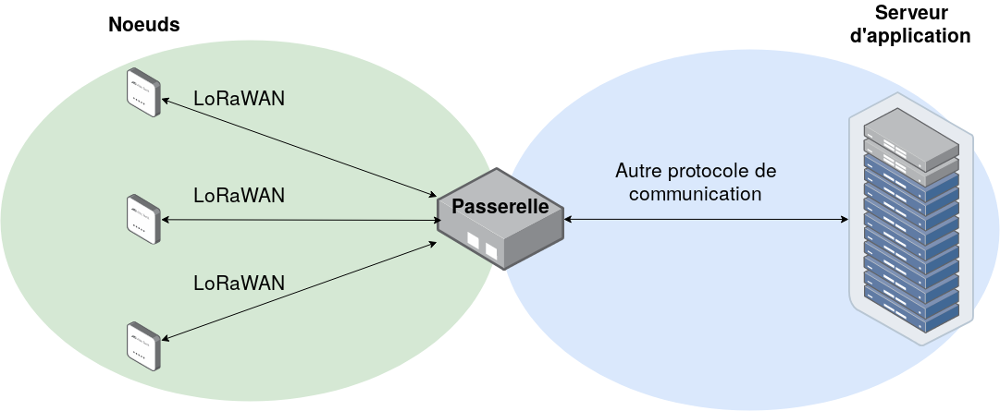
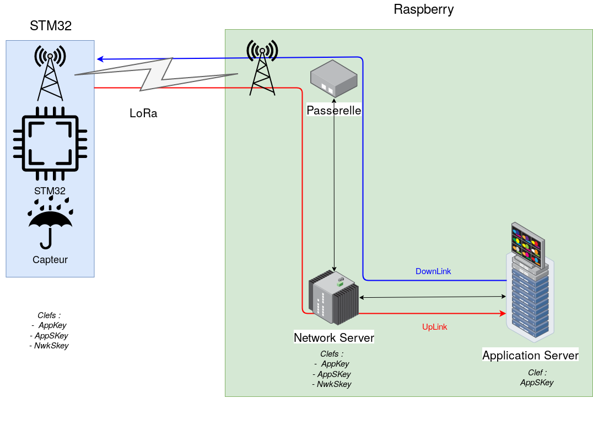

 # Spécification
Le travail de sécurisation à fournir pour la fin de ce projet vise 2 parties du réseau, la *passerelle* et le *noeud* nous ne nous occuperons pas de la sécurisation de la communiction en **LoRa**.
Le LoRaWAN est un protocole de communication à longue distance et faible consommation d'énergie. Il est composé de 3 services. Les *noeuds*, la *passerelle* et le *serveur d'applications*. 

Le schéma ci-dessous résume simplement la situation.

Le protocole LoRa n'est pas fait pour envoyer de grandes quantités d'information très rapidement. On ne peut envoyer que quelques KiloOctets par intervalle de quelques minutes.

Dans sa version 1.0 le LoRaWAN spécifie déjà plusieurs directives à suivre pour le sécuriser.
Il y a une clef ***AES 128bits*** à fournir pour sécuriser la commuication depuis le *noeud* jusqu'au *serveur d'application*.
- **AppKey** Clef AES principale. Elle doit être connue *du noeud* et *du network manager*. Elle sert ensuite à déterminer les 2 clefs suivantes.
- **NwkSKey** Network Session key : chiffre la communication entre le *noeud* et *le network server*. Elle sert à détecter une éventuelle perte d'information dans le message.
- **AppSKey** Application Session key : chiffre le message entre *le noeud* et *le network server*, sans cette clef il est impossible de lire le message.

Les clefs **NwkSKey** et **AppSKey** sont actualisées à chaque nouvelle connexion d'un appareil, elles sont uniques à chaque *noeud* du réseau.

Le LoRaWAN utilise des *frame counter* à fin d'éviter les attaques par répétition.
Deux compteurs sont initialisés lorsqu'un nouvel appareil est connecté.
Le noeud incrémente le compteur **FCntUP** à chaque fois que qu'il envoit une information sur le *UpLink*. Le Network serveur, lui, incrémente le compteur **FCntDown** à chaque fois qu'il écrit sur le *DownLink*. Pour chaque trame du réseau la valeur des compteurs est envoyée avec. Le récepteur de la trame va comparer la valeur des compteurs à l'intérieur de la trame avec ses propres compteurs et si la valeur des compteurs de la trame est inferieure au compteur du récepteur, ce dernier va ignorer le message.

## Le noeud
Le *noeud* sera composé d'un microcontrôleur, d'un capteur (ou plusieurs) et d'un module permettant la communication en LoRa. Pour le noeud nous allons utiliser un kit de développement provenant de STMicroelectronics.

Nous regroupons ci-dessous les attaques possibles. Ce sera notre base de travail pour sécuriser la communication.

Surface d'attaque : 
-  Gestion des Clés AES
-  Modification du code source
-  Interception des données directement sur le capteur
-  SPA
-  DPA
-  Analyse EM
-  Memory dumping
-  Valeur des Frame Counters

Les secrets à protéger sont :
-  La valeur du capteur
-  Les clefs **NwkSKey** et **AppSkey** et la clef AES **AppKey**

## La passerelle
La *passerelle* sert de traducteur entre le protocole *LoRa* et un autre protocole de communication. Elle sera hébergée sur un micro-ordinateur.

## Network Server
Le *Network server* est le cerveau du réseau LoRaWAN, il génère les clefs et authentifie les noeuds. Il déchiffre aussi une partie des trames du réseau.

Surface d'attaque :
- Enregistrement clef AES
- Création des clefs **NwkSKey** et **AppSKey**

Secrets à protéger
- La valeur des clefs **NwkSKey**, **AppSKey** et **AppKey**

## Application Server
Le *Application server* est le service qui va traiter l'information du capteur, il va déchiffrer la dernière partie du message.

Surface d'attaque :
- Réception de la clef **AppSKey**
- Gestion de la clef **AppSKey**

Secret à protéger :
- La valeur de la clef **AppSKey**

## Schéma récapitulatif

Le schéma ci-dessous récapitule le protocole de communication dans son ensemble.

## Mise en place d'un banc de test
Nous avons défini 3 cas d'usage ayant une complexité croissante:

1. Mise en place d'un Noeud LoRaWAN de *classe A* qui envoit des valeurs de température et d'humidité, à une Box LoRa (passerelle + network server + application server) celle-ci devra afficher les valeurs des capteurs dans un terminal
2. Mise en place de 2 Noeuds  LoRa 1.0 de *classe A* qui envoit les valeurs de température et d'humidité à la box LoRa. Celle-ci affiche et traite les valeurs. En foncton des valeurs obtenues, elle va envoyer une commande à un 2ème noeud LoRa qui sera de *classe B* et qui allumera ou non une LED en fonction de la commande.
3. Même cas que précédement mais en ajoutant des services et des utilisateurs en plus à la box LoRa afin de simuler un mini-serveur d'entreprise.

## Analyse des risques

Pour le cas d'usage, nous avons défini que les aspects de non-répudiation et de confidentialité ne sont pas les plus critiques, car nous voulons transmettre uniquement la température et l'humidité. Nous traiterons donc les paramètres d'intégrité et d'authenticité.
Il faut éviter qu'une personne vienne altérer l'information envoyée. Nous devons être sûrs que le *noeud* qui envoit l'information est bien le *noeud* que nous avons créé et pas celui d'un éventuel attaquant (par exemple : *man in the middle*).

| Menaces envisageables                                                         | Risques à considérer | Contres mesures                                                  |
|-------------------------------------------------------------------------------|----------------------|------------------------------------------------------------------|
| Dump mémoire STM32 et Raspberry                                               | ✓                    | Hasher la clef / Composant de sécurité pour le firmware et clef  |
| Canaux cachés   (DPA, SPA)                                                    | ⨯                    |                                                                  |
| Autre Noeud usurpant l'identité de notre Noeud (altération des données)       | ✓                    | Signature et certificat                                          |
| Mise à jour venant d'une entité autre que le serveur de mise à jour officiel  | ✓                    | Signature des MAJ / certificat                                   |
| Interception des mises à jour                                                 | ✓                    | VPN                                                              |
| Execution d'un OS malicieux sur la box LoRA                                   | ✓                    | Secure boot                                                      |
| Modification du programme du noeud                                            | ✓                    | Condamnation des GPIO de debogage                                |
| DoS attaque par envoi massif de données sur la Box LoRa                       | ✓                    | Limiter la réception d'un nombre de trames par X temps            |

## Méthodologie gestion de projet

Pour gérer le projet nous utilisons un outil de *versionning* appelé Github, où on y met tout le code du projet, les sources ainsi que la documentation. Pour nous organiser tout au long de la période du projet nous avons créé un diagramme de GANTT. Nous le garderons à jour pendant toute la durée du projet. Pour avoir une gestion de projet plus précise (tâches à effectuer chaques semaines), nous utilisons l'onglet *Project* de notre *repository* Github. Dans cet onglet nous indiquons pour chaque semaine les différentes tâches à faire. Les tâches ont 3 états **A faire**, **En cours** et **Fini** nous déplaçons et nous ajoutons des tâches au cours de la semaine.

Pour la méthode de gestion de projet nous allons utiliser la methode en "spirale". En commençant par créer un réseau LoRaWAN basique, puis nous ajouterons des couches de sécurité au fur et à mesure.

Le logiciel que nous allons utiliser pour développer sur STM32 est le logiciel *STM32CubeIDE* il nous permet de facilement générer la configuration du microcontrôleur grâce à l'intégration de CubeMX puis de développer notre programme grace à *Attolic*.