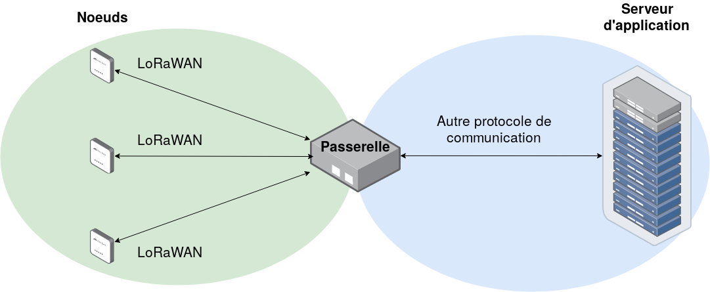
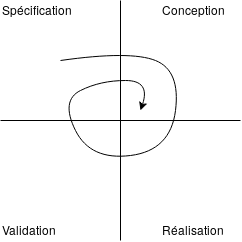

Introduction
============

Projet M1 CSSE *mise en oeuvre d'un réseau LoRaWAN sécurisé* 2019-2020

Ceci est la documentation de notre projet de sécurisation d'une communication LoRaWAN.

**Contexte :**

L’Internet des objets (IoT, en anglais) est un paradigme dont les premiers déploiements ont quelques années (voire plus, si l’on parle de réseau de capteurs).
D’un point de vue sécurité, l’IoT a une surface d’attaque très importante, du fait du nombre de technologies, de protocoles, du type de déploiement et du nombre d’acteurs différents.
Ce projet s’applique aux réseaux d’objets connectés longue porté du type Lo-
RaWAN (Long Range Wide Area Network).

**Mission :**

Dans ce contexte, il nous est demandé de mettre en place un réseau LoRaWAN sécurisé.
Le premier et principal objectif est de créer un réseau LoRaWAN complet, mais simple et fonctionnel, dont les éléments de sécurité côté noeud et passerelle seront correctement mis en oeuvre. 
Toute une démarche de tests unitaires devra être mise en place, pour tester chacune des parties séparément, puis l'ensemble collectivement. 

Un cas d’usage, défini avec notre responsable devra être mis en place et les aspects de sécurité devront être bien maîtrisés. 

Le deuxième objectif consiste à discuter de la surface d’attaque de notre système. 
Un aspect analyse est donc demandé en prenant en compte les différentes versions du LoRaWAN, chacun des éléments du système etc.

Mise au point : vocabulaire
===========================

LoRaWAN : 
> Long Range Wide Area Network. Protocole de communication.

Noeud : 
> Ensemble de composants qui peuvent recevoir et/ou envoyer de l'information via le protocole de communication LoRaWAN. Branche initiale d'un réseau LoRaWAN. Par exemple, un capteur relié à une carte/microcontrôleur et une antenne pour la communication vers l'extérieur.

Passerelle : 
> Élément de transfert. Permet de traduire et transférer les données venant du noeud vers les serveurs.

*Network server* : 
> Cerveau du réseau LoRaWAN, il génère les clefs et authentifie les noeuds. Il déchiffre aussi une partie des trames du réseau, reçues via la passerelle.

*Application server* : 
> Service qui va traiter l'information du capteur, il va déchiffrer la dernière partie du message.

Box LoRa :
> Pour notre projet, sera un micro-ordinateur *Raspberry* qui va contenir la passerelle, le *network server* et l'*application server*

Schéma simplifié 
================

Le schéma ci-dessous est un schéma simplifié, permettant de comprendre le fonctionnement global de notre système.

Nous avons donc plusieurs noeuds, qui vont communiquer en LoRaWAN avec une passerelle. Cette passerelle va ensuite communiquer ce qu'elle a reçu des noeuds au serveur d'application, via un autre protocole de communication.

Points d’action (format poupées russes) :
=========================================

/!\ A compléter avec [ces notes](../docs/notes_personelles/Notes_Arthur.md "Notes Arthur")

Modèle de fonctionnement en "poupées russes"

- Mise en place et déploiement d’un réseau LoRaWAN sécurisé
  - Prise en main du matériel, lecture de documentation, compréhension
  - Utilisation pour un déploiement simple
  - Tests unitaires de fonctionnement
  - Si les tests sont concluants, sécurisation un à un des composants et des logiciels

- Sécurisation de la *passerelle*, du *network serveur* et de l’*application serveur*

- Sécurisation du (des) *noeud(s)*

- Analyse et discussion de la sécurité du système (éventuellement *pentest*)
  

| Créer OS                                                             | Prendre LoRa Server                                                   |
|----------------------------------------------------------------------|-----------------------------------------------------------------------|
| ++ Parfaite connaissance des programmes fonctionnant sur le serveur  | ++ Rapidité de mise en place                                          |
| -- Recherche de recettes à mettre en oeuvre                          | -- Recherche des pogrammmes installé pour vérifier s'ils sont sécuisé |

--------------

- Mise en place d'un réseau LoRaWAN sécurisé
    - Mise en place d'un réseau LoRaWAN avec sécurité basique (mot de passe)
        - Création d'un premier réseau (facile) entre le microcontrôleur *Fipy* et le capteur *Pysense* pour la partie noeud et une Raspberry pour la partie box LoRa 

        - Création d'un deuxième réseau identique identique au précédent, mais en remplaçant le noeud par une carte STM32 équipé d'un shield Motion MEMS and environmental (Nucleo expansion board)

        - Construction des services de la Box LoRa
            - Création d'un OS Perso vs Utilsation d'un OS existant (LoRaServer IO)
                Notre choix se portera sur l'utilisation d'un OS déjà existant. Sa rapidité de mise en oeuvre et son adaptabilité nous font pencher en sa faveur. Beaucoup de temps de développement est ainsi gagné en prenant l'OS *LoRaserver.io*
            - Choix de prendre un OS *Full*, qui contient *gateway* + *network server* + *application server* en interne, et permet une gestion simplifiée.
    - Tests :
        - Vérification que la valeur du capteur est correcte 
            - Afficher la valeur de celle-ci dans le terminal et comparer avec la température ambiante

        - Vérifier que la valeur est émise
            - ??
        - Vérifier que la valeur est arrivée 
            - ??
        
        - Vérifier que la valeur est bien transmise dans la box LoRA
            - Regarder sur la partie application server que la valeure est la même que celle affichée dans le terminal du micro Controler
    - Mise en place d'un réseau avec des couches de sécurité renforcé
        - Sécurisation du Noeud
            - Développer le software du Noeud LoRaWAN
                - Sécurisation du Noeud en cachant les clefs dans la mémoire
                - Sécurisation du Noeud en cachant les clefs dans un composant de sécurité
                    - ATEC508A
                    
        - Sécurisation de la Box LoRa 
            - Points de vu 1 : La Box LoRa est le seul composant du serveur
                - Sécurisation vis à vis d'intrusion externe au systeme
                    - VPN 
                - Maintenance 
                    - Mise à jours
                    - SSH
                - Verification des services
            - Point de vu 2 :  La Box LoRa ne sert pas uniquement à au LoRa WAN
                - Sécurisation par rapport aux autres service présent et/ou utilisateurs 
                    - Vérifier les droits d'accées 
        

--------------

Répartition des tâches 
======================

Pour faire ce travail, nous sommes deux personnels travaillant à plein temps, Arthur et François.
Nous devons donc répartir équitablement les tâches.

Dans un premier temps, nous allons tous les deux travailler au déploiement du réseau LoRaWAN. 

François va ensuite se charger de la sécurisation de la passerelle, ainsi que des connections avec le network server et l'application server.

Arthur se chargera de travailler sur la sécurisation du noeud, et le transfert des informations vers la passerelle.

Tous les deux s'occuperont de rédiger constamment une documentation fournie ainsi que tous les documents livrables attendus.

Organisation
============

Nous avons choisi une approche en spirale pour notre organisation. En effet, sur les conseils de notre encadrant, ce modèle nous permet de tester les différentes couches de sécurisation une à une et de revenir aux étapes précédentes si besoin pour modifier et compléter le dispositif.

Le schéma ci-dessous montre simplement le fonctionnement d'une organisation en spirale.

Contraintes
===========

- Protocole de communication LoRaWAN entre la passerelle et les noeuds
- Utilisation du matériel fourni par l'encadrant
