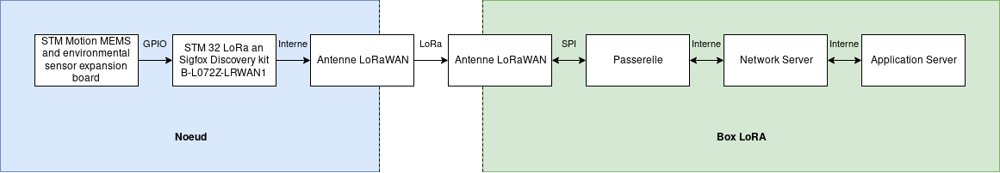

Introduction
============

Projet M1 CSSE *mise en oeuvre d'un réseau LoRaWAN sécurisé* 2019-2020

Ceci est la documentation de notre projet de sécurisation d'une communication LoRaWAN.

**Contexte :**

L’Internet des objets (IoT, en anglais) est un paradigme dont les premiers déploiements ont quelques années (voire plus, si l’on parle de réseau de capteurs).
D’un point de vue sécurité, l’IoT a une surface d’attaque très importante, du fait du nombre de technologies, de protocoles, du type de déploiement et du nombre d’acteurs différents.
Ce projet s’applique aux réseaux d’objets connectés longue porté du type LoRaWAN (Long Range Wide Area Network).

**Mission :**

Dans ce contexte, il nous est demandé de mettre en place un réseau LoRaWAN sécurisé.
Le premier et principal objectif est de créer un réseau LoRaWAN complet, mais simple et fonctionnel, dont les éléments de sécurité côté noeud et passerelle seront correctement mis en oeuvre. 
Toute une démarche de tests unitaires devra être mise en place, pour tester chacune des parties séparément, puis l'ensemble collectivement. 

Un cas d’usage, défini avec notre responsable devra être mis en place et les aspects de sécurité devront être bien maîtrisés. 

Le deuxième objectif consiste à discuter de la surface d’attaque de notre système. 
Un aspect analyse est donc demandé en prenant en compte les différentes versions du LoRaWAN, chacun des éléments du système etc.

Mise au point : vocabulaire
===========================

LoRaWAN : 
> Long Range Wide Area Network. Protocole de communication.

Noeud : 
> Ensemble de composants qui peuvent recevoir et/ou envoyer de l'information via le protocole de communication LoRaWAN. Branche initiale d'un réseau LoRaWAN. Par exemple, un capteur relié à une carte/microcontrôleur et une antenne pour la communication vers l'extérieur.

Passerelle ou *Gateway* : 
> Élément de transfert. Permet de traduire et transférer les données venant du noeud vers les serveurs.

*Network server* : 
> Cerveau du réseau LoRaWAN, il génère les clefs et authentifie les noeuds. Il déchiffre aussi une partie des trames du réseau, reçues via la passerelle.

*Application server* : 
> Service qui va traiter l'information du capteur, il va déchiffrer la dernière partie du message.

Box LoRa :
> Pour notre projet, sera un micro-ordinateur *Raspberry* qui va contenir la passerelle, le *network server* et l'*application server*

Schéma simplifié 
================

Le schéma ci-dessous est un schéma simplifié, permettant de comprendre le fonctionnement global de notre système.

Nous avons donc plusieurs noeuds, qui vont communiquer en LoRaWAN avec une passerelle. Cette passerelle va ensuite communiquer ce qu'elle a reçu des noeuds au serveur d'application, via un autre protocole de communication.

Spécifications 
==============

Le protocole LoRa n'est pas fait pour envoyer de grandes quantités d'information très rapidement. On ne peut envoyer que quelques KiloOctets par intervalle de quelques minutes.

Dans sa version 1.0 le LoRaWAN spécifie déjà plusieurs directives à suivre pour le sécuriser.
Il y a une clef ***AES 128bits*** à fournir pour sécuriser la commuication depuis le *noeud* jusqu'au *serveur d'application*.
- **AppKey** Clef AES principale. Elle doit être connue *du noeud* et *du network manager*. Elle sert ensuite à déterminer les 2 clefs suivantes.
- **NwkSKey** Network Session key : chiffre la communication entre le *noeud* et *le network server*. Elle sert à détecter une éventuelle perte d'information dans le message.
- **AppSKey** Application Session key : chiffre le message entre *le noeud* et *le network server*, sans cette clef il est impossible de lire le message.

Les clefs **NwkSKey** et **AppSKey** sont actualisées à chaque nouvelle connexion d'un appareil, elles sont uniques à chaque *noeud* du réseau.

Le LoRaWAN utilise des *frame counter* à fin d'éviter les attaques par répétition.
Deux compteurs sont initialisés lorsqu'un nouvel appareil est connecté.
Le noeud incrémente le compteur **FCntUP** à chaque fois que qu'il envoit une information sur le *UpLink*. Le Network serveur, lui, incrémente le compteur **FCntDown** à chaque fois qu'il écrit sur le *DownLink*. Pour chaque trame du réseau la valeur des compteurs est envoyée avec. Le récepteur de la trame va comparer la valeur des compteurs à l'intérieur de la trame avec ses propres compteurs et si la valeur des compteurs de la trame est inferieure au compteur du récepteur, ce dernier va ignorer le message.

### Le noeud
Le *noeud* sera composé d'un microcontrôleur, d'un capteur (ou plusieurs) et d'un module permettant la communication en LoRa. Pour le noeud nous allons utiliser un kit de développement provenant de STMicroelectronics.

Nous regroupons ci-dessous les attaques possibles. Ce sera notre base de travail pour sécuriser la communication.

Surface d'attaque : 
-  Gestion des Clés AES
-  Modification du code source
-  Interception des données directement sur le capteur
-  SPA
-  DPA
-  Analyse EM
-  Memory dumping
-  Valeur des Frame Counters

Les secrets à protéger sont :
-  La valeur du capteur
-  Les clefs **NwkSKey** et **AppSkey** et la clef AES **AppKey**

### La passerelle
La *passerelle* sert de traducteur entre le protocole *LoRa* et un autre protocole de communication. Elle sera hébergée sur un micro-ordinateur.

### Network Server
Le *Network server* est le cerveau du réseau LoRaWAN, il génère les clefs et authentifie les noeuds. Il déchiffre aussi une partie des trames du réseau.

Surface d'attaque :
- Enregistrement clef AES
- Création des clefs **NwkSKey** et **AppSKey**

Secrets à protéger
- La valeur des clefs **NwkSKey**, **AppSKey** et **AppKey**

### Application Server
Le *Application server* est le service qui va traiter l'information du capteur, il va déchiffrer la dernière partie du message.

Surface d'attaque :
- Réception de la clef **AppSKey**
- Gestion de la clef **AppSKey**

Secret à protéger :
- La valeur de la clef **AppSKey**

Points d’action (format poupées russes) :
=========================================

Mise en place d'un réseau LoRaWAN sécurisé

- Mise en place d'un réseau LoRaWAN avec sécurité basique (mot de passe)
  - Création d'un premier réseau (facile) entre le microcontrôleur *Fipy* et le capteur *Pysense* pour la partie noeud et une Raspberry pour la partie box LoRa. Ce premier réseau nous permet de prendre en main le fonctionnement global du LoRa, sans ajouter les complexités d'une carte STM, en travaillant avec un environnement de noeud plus simple.

    - Rédaction d'un tutoriel pour le déploiement de ce réseau. [Documentation complète](./Mise_en_place_d'un_reseau_simple.md "Documentation réseau") pour une prise en main simple. 

  - Création d'un deuxième réseau identique identique au précédent, mais en remplaçant le noeud par une carte STM32 équipé d'un shield Motion MEMS and environmental (Nucleo expansion board). La finalité de notre réseau est, en effet, d'utiliser une carte STM32 pour le noeud.

  - Construction des services de la Box LoRa
      - Création d'un OS vs. Utilsation d'un OS existant (LoRaServer io)
          Notre choix se portera sur l'utilisation d'un OS déjà existant. Sa rapidité de mise en oeuvre et son adaptabilité nous font pencher en sa faveur. Beaucoup de temps de développement est ainsi gagné en prenant l'OS *LoRaserver.io*
      - Choix de prendre un OS *Full*, qui contient *gateway* + *network server* + *application server* en interne, et permet une gestion simplifiée.

- Tests unitaires de fonctionnement :
    - Vérification : la valeur du capteur est-elle correcte ?
        - Afficher la valeur de celle-ci dans le terminal et comparer avec la température ambiante réelle.

    - Vérifier que la valeur est émise correctement.
        - Émission des trames LoRa. Travail à l'analyseur de spectres de fréquences.
    - Vérifier que la valeur est arrivée 
        - Réception des trames LoRa, via l'interface graphique. 
    
    - Vérifier que la valeur est bien transmise dans la box LoRA
        - Regarder sur la partie *application server* que la valeur est la même que celle affichée dans le terminal du microcontrôleur

- Mise en place d'un réseau avec des couches de sécurité renforcées
    - Sécurisation du noeud
        - Développer le software du noeud LoRaWAN
            - Sécurisation du noeud en cachant les clefs dans la mémoire (composant de sécurité : ATEC508A ou autre)
            - Sécurisation du noeud en cachant les clefs logiciellement
                
    - Sécurisation de la Box LoRa 
        - Cas 1 : La box LoRa est le seul composant du serveur
            - Sécurisation vis à vis d'intrusion externe au systeme : VPN 
            - Maintenance : Mise à jours, SSH
            - Verification des services
        - Cas 2 :  La box LoRa ne sert pas uniquement à au LoRa WAN
            - Sécurisation par rapport aux autres service présent et/ou utilisateurs : Vérifier les droits d'accès 
    
Schéma technique des prototypes : 
================================

Ce premier schéma ci-dessous nous montre la chaine technique des composants du premier réseau simple pour la création du prototype.

Ce deuxième schéma ci-dessous nous montre la version finale du réseau tel qu'il sera construit.

Répartition des tâches 
======================

Pour faire ce travail, nous sommes deux personnels travaillant à plein temps, Arthur et François.
Nous devons donc répartir équitablement les tâches.

Dans un premier temps, nous allons tous les deux travailler au déploiement du réseau LoRaWAN. 

François va ensuite se charger de la sécurisation de la passerelle, ainsi que des connections avec le *network server* et l'*application server*.

Arthur se chargera de travailler sur la sécurisation du noeud, et le transfert des informations vers la passerelle.

Tous les deux s'occuperont de rédiger constamment une documentation fournie ainsi que tous les documents livrables attendus.

Organisation
============

Nous avons choisi une approche en spirale pour notre organisation. En effet, sur les conseils de notre encadrant, ce modèle nous permet de tester les différentes couches de sécurisation une à une et de revenir aux étapes précédentes si besoin pour modifier et compléter le dispositif.

Le schéma ci-dessous montre simplement le fonctionnement d'une organisation en spirale.

Contraintes :
=============

- Protocole de communication LoRaWAN entre la passerelle et les noeuds
- Utilisation du matériel fourni par l'encadrant

Matériel :
==========

Voici le matériel dont nous disposons :

* Lorawan discovery kit : https://www.st.com/en/evaluation-tools/b-l072z-lrwan1.html

* MEMS environmental shield : https://www.st.com/en/ecosystems/x-nucleo-iks01a1.html

* LoRaWAN concentrator : https://shop.imst.de/wireless-modules/lora-products/8/ic880a-spi-lorawan-concentrator-868-mhz?number=404802 

* Carte Fipy : https://docs.pycom.io/datasheets/development/fipy/ 

* Carte pysense : https://pycom.io/product/pysense/ 

* Antenne : https://www.gotronic.fr/art-kit-antenne-pour-lora-et-sigfox-25376.htm 

* Raspberry pi 3b : https://www.raspberrypi.org/products/raspberry-pi-3-model-b/ 

