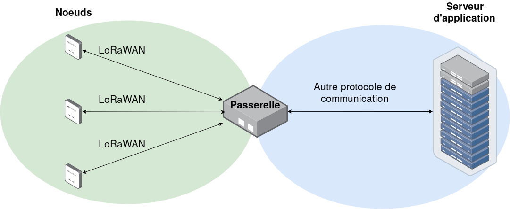

Introduction
============

Projet M1 CSSE *mise en oeuvre d'un réseau LoRaWAN sécurisé* 2019-2020

Ceci est la documentation de notre projet de sécurisation d'une communication LoRaWAN.

**Contexte :**

L’Internet des objets (IoT, en anglais) est un paradigme dont les premiers déploiements ont quelques années (voire plus, si l’on parle de réseau de capteurs).
D’un point de vue sécurité, l’IoT a une surface d’attaque très importante, du fait du nombre de technologies, de protocoles, du type de déploiement et du nombre d’acteurs différents.
Ce projet s’applique aux réseaux d’objets connectés longue porté du type LoRaWAN (Long Range Wide Area Network).

**Mission :**

Dans ce contexte, il nous est demandé de mettre en place un réseau LoRaWAN sécurisé.
Le premier et principal objectif est de créer un réseau LoRaWAN complet, mais simple et fonctionnel, dont les éléments de sécurité côté noeud et passerelle seront correctement mis en oeuvre. 
Toute une démarche de tests unitaires devra être mise en place, pour tester chacune des parties séparément, puis l'ensemble collectivement. 

Un cas d’usage, défini avec notre responsable devra être mis en place et les aspects de sécurité devront être bien maîtrisés. 

Le deuxième objectif consiste à discuter de la surface d’attaque de notre système. 
Un aspect analyse est donc demandé en prenant en compte les différentes versions du LoRaWAN, chacun des éléments du système etc.

Mise au point : vocabulaire
---------------------------

LoRaWAN : 
> Long Range Wide Area Network. Protocole de communication.

Noeud : 
> Ensemble de composants qui peuvent recevoir et/ou envoyer de l'information via le protocole de communication LoRaWAN. Branche initiale d'un réseau LoRaWAN. Par exemple, un capteur relié à une carte/microcontrôleur et une antenne pour la communication vers l'extérieur.

Passerelle ou *Gateway* : 
> Élément de transfert. Permet de traduire et transférer les données venant du noeud vers les serveurs.

*Network server* : 
> Cerveau du réseau LoRaWAN, il génère les clefs et authentifie les noeuds. Il déchiffre aussi une partie des trames du réseau, reçues via la passerelle.

*Application server* : 
> Service qui va traiter l'information du capteur, il va déchiffrer la dernière partie du message.

Box LoRa :
> Pour notre projet, sera un micro-ordinateur *Raspberry* qui va contenir la passerelle, le *network server* et l'*application server*

Schéma simplifié 
----------------

Le schéma ci-dessous est un schéma simplifié, permettant de comprendre le fonctionnement global de notre système.

Nous avons donc plusieurs noeuds, qui vont communiquer en LoRaWAN avec une passerelle. Cette passerelle va ensuite communiquer ce qu'elle a reçu des noeuds au serveur d'application, via un autre protocole de communication.

